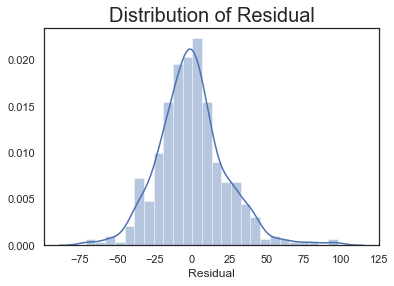

# Agriculture_Project

## Project Managers
 - Hua Shi
 - Trevor O'Hearn

## Goal
 - To research the relationship between income and other variables and to determine which one affects the income the most; as well as, do a Regression on the different Regions of the United States of America
 
 # Data Process
 - Clean five tables of Census Data from 2017.
 - Removed columns with more than 20% missing data
 - Removed data outside the 95th percent quantile
 - Created categorical dummy variables for region and land size
 - Took the square root of the target variable
 
 # Statistical Tests
 - Chi squared test on 4 regions of the US
   - Reject the null hypothesis that the means of the region are the same
 - Two sample mean test
   - Rejected null hypothesis that the means of workers working more or less than 150 days are the same
 - Chi squared test on the categorical size of the Land
   - Reject the null hypothesis that the means of the size of land are the same
 
 # Linear Models used
 - Scaled the data using the standard scalar
 - Train-test-split the data 
 - Determined the proper feature selection based on 5000 iterations of train-test-splitting the data 
 - Performed three regression models on the overall data as well as the the four separate regions of the U.S
 - Found the best model to be the Ridge Regression
 
 #EDA
 
 
 
 
 # Feature Explanation
 - The top, and most obscure feature, overall, is the inventory of the farm's horses and ponies
 - The other four top features dealt with either money or land
 - The amount of government funding received or 
 - The efficiency of the land used
 - Market value of equipment on site such as machinery
 
 # Conclusion
 - The horse business is large and has a massive impact on the farming business
 - There is a target amound of land to have and efficient use of that land is important
 - Major assets help determine the farm's ability to thrive in the market
 
 ### Sources
  - https://www.nass.usda.gov/Publications/AgCensus/2017/index.php#highlights
 ### Powerpoint
  - https://docs.google.com/presentation/d/1VkiJMo7tENhxQyWEJM6R-SV0TAAuppFtSI037s9Xv_s/edit#slide=id.g7e392c2e99_0_119
